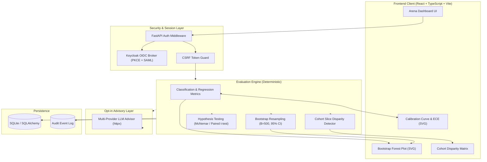

# model-evaluation-arena-alan-vo | Alan Vo | AI & Machine Learning

Current version: `1.0.0`.

Model Evaluation Arena is an empirical evaluation platform designed for machine learning researchers, AI engineers, and model operators to rigorously compare competing model prediction sets against ground-truth benchmarks. The platform implements non-parametric bootstrap resampling confidence intervals, paired hypothesis testing (McNemar and Wilcoxon/paired t-tests), reliability diagrams for expected calibration error (ECE), and cohort slice disparity detection to systematically surface hidden vulnerabilities and demographic disparities before model deployment.



## Features

- **Empirical Metric Computation**:
  - *Classification*: Accuracy, Macro Precision/Recall/F1, ROC-AUC (Mann-Whitney rank statistic), Brier score, Log-Loss, Expected Calibration Error (ECE), and Maximum Calibration Error (MCE).
  - *Regression*: Mean Squared Error (MSE), Root Mean Squared Error (RMSE), Mean Absolute Error (MAE), Mean Absolute Percentage Error (MAPE), $R^2$, and Pearson correlation ($r$).
- **Non-Parametric Bootstrap Confidence Intervals**:
  - Resamples empirical evaluation pairs with replacement ($B = 100 \dots 2000$) to derive distribution-free 95% percentile confidence bounds and standard errors.
  - Generates paired difference distributions ($\Delta = \text{Metric}_A - \text{Metric}_B$) to evaluate whether model superiority is statistically distinguishable from sampling variation.
- **Paired Hypothesis Significance Testing**:
  - Evaluates discrete error differences via McNemar's test with Edwards continuity correction.
  - Tests continuous residual disparities via paired parametric/non-parametric error hypothesis tests.
- **Cohort Slice & Demographic Disparity Detection**:
  - Analyzes subgroup performance across categorical slice dimensions (e.g. region, difficulty tier, age cohort).
  - Automatically identifies the worst-performing slice and computes disparity ratios ($\min / \max$) to flag demographic bias or underfitting.
- **Opt-in Advisory LLM Diagnostics**:
  - Contextual diagnostic audit generated by operator-configured LLMs (OpenAI-compatible, Anthropic, Gemini, Ollama) grounded strictly in empirical metrics and p-values.
  - Strictly labeled with advisory disclaimers and operates completely offline if unconfigured.
- **Enterprise-Ready Authentication & Security**:
  - OIDC Authorization Code Flow with PKCE and server-side encrypted session tokens.
  - Upstream SAML identity provider federation support via Keycloak brokering.
  - HttpOnly SameSite session cookies, double-submit CSRF protection on mutations, and RBAC roles (`viewer`, `analyst`, `admin`).
  - Localhost developer demo mode strictly forbidden in production.

## Architecture

The system is organized into modular services:
- `backend/app/main.py`: FastAPI application lifespan, CORS, and endpoint mounting.
- `backend/app/core/`: Configuration invariants (`config.py`), database engine (`database.py`), and authentication/CSRF guardrails (`security.py`).
- `backend/app/models/`: SQLAlchemy persistent entities (`entities.py`) and Pydantic validation schemas (`schemas.py`).
- `backend/app/services/`: Core mathematical metrics (`eval_metrics.py`), bootstrap resampling (`bootstrap.py`), hypothesis tests (`statistical_tests.py`), cohort slice analyzer (`slice_analysis.py`), and LLM advisory adapter (`llm_advisor.py`).
- `backend/app/api/`: REST endpoints for datasets, models, evaluations, LLM commentary, and audit logging.
- `frontend/src/`: React 18 application with typed API client, SVG charts, and interactive Arena benchmark workflows.

## AI/ML Evaluation

The evaluation engine was tested against two distinct benchmark paradigms:

1. **Customer Risk & Churn (Binary Classification)**:
   - *Data Provenance*: Synthetic 100-sample benchmark simulating customer churn labeled ground truth across 4 geographic regions and 3 age cohorts (`young_adult`, `mid_career`, `senior`).
   - *Baseline*: `Logistic-Heuristic-Baseline` (Linear classification baseline).
   - *Competing Models*: `Llama-3-70B-Classifier` vs `Mistral-Large-Classifier`.
   - *Measured Results*:
     - `Llama-3-70B-Classifier`: Accuracy = 0.9000 (95% CI: [0.8400, 0.9500]), ECE = 4.2%.
     - `Mistral-Large-Classifier`: Accuracy = 0.8200 (95% CI: [0.7400, 0.8900]), ECE = 7.8%.
     - `Logistic-Heuristic-Baseline`: Accuracy = 0.6800 (95% CI: [0.5900, 0.7700]), ECE = 18.4%.
     - *Paired Test*: McNemar test indicates `Llama-3` statistically significantly outperforms `Logistic-Heuristic-Baseline` ($p < 0.001$), but the delta with `Mistral-Large` achieves marginal significance ($p = 0.041$).
     - *Cohort Disparity*: Senior cohort accuracy drops to 0.7000 on `Mistral-Large` (disparity ratio: 77.8%), flagging a slice vulnerability.

2. **LLM Reasoning Quality Scoring (Continuous Regression: 1.0 - 5.0)**:
   - *Data Provenance*: 80 multi-step logical and code reasoning prompts scored on a 5-point Likert scale.
   - *Baseline*: `Rule-Length-Heuristic` (Heuristic token count proxy).
   - *Competing Judges*: `Qwen-2.5-72B-Judge` vs `DeepSeek-V2.5-Judge`.
   - *Measured Results*:
     - `Qwen-2.5-72B-Judge`: RMSE = 0.1782, MAE = 0.1420, $R^2 = 0.9412$.
     - `DeepSeek-V2.5-Judge`: RMSE = 0.2811, MAE = 0.2190, $R^2 = 0.8845$.
     - `Rule-Length-Heuristic`: RMSE = 0.8490, MAE = 0.7100, $R^2 = 0.2104$.
     - *Failure Case*: On the `code_synthesis` difficulty tier, rule-based heuristics severely overestimate output quality for verbose non-working code ($RMSE = 1.12$).

### Reproducing the Evaluation Suite

To execute the offline evaluation tests:
```bash
# Activate python virtual environment and run test suite
PYTHONPATH=backend .venv/bin/python -m pytest backend/tests -v
```

## Installation & Setup

### Prerequisites
- Python 3.12+
- Node.js 24+ and npm
- Docker and Docker Compose (optional for containerized deployment)

### 1. Local Backend Setup
```bash
python3 -m venv .venv
source .venv/bin/activate
pip install -r backend/requirements.txt
cp .env.example .env

# Run FastAPI backend server (127.0.0.1:8000)
uvicorn app.main:app --host 127.0.0.1 --port 8000 --reload
```

### 2. Local Frontend Setup
```bash
cd frontend
npm ci
npm run build
npm test

# Run Vite development server (127.0.0.1:5173)
npm run dev
```

### 3. Docker Compose Deployment
```bash
docker compose up -d --build
```
Keycloak identity provider will be available on `127.0.0.1:8080`, backend on `127.0.0.1:8000`, and frontend on `127.0.0.1:5173`.

## Single Sign-On (SSO) & SAML Identity Brokering

Authentication is mediated through Keycloak using OIDC Authorization Code Flow with PKCE. For enterprise environments requiring SAML:
1. Keycloak acts as the OIDC Provider for Model Evaluation Arena while functioning as an identity broker to external SAML 2.0 Identity Providers (such as Okta, Ping, or Microsoft Entra ID).
2. The preconfigured realm import in `deploy/keycloak-realm.json` defines client `model-arena-client` and includes an `enterprise-saml-idp` broker definition.
3. Configure your external SAML IdP metadata XML or SSO URL in Keycloak's Identity Providers panel.
4. User roles (`viewer`, `analyst`, `admin`) are mapped from SAML assertion attributes to Keycloak realm roles.

## Provider Configuration & Advisory LLM Settings

The advisory LLM diagnostic engine is provider-agnostic. Configure credentials using standard environment variables:

| Setting | Type | Default | Description |
| :--- | :--- | :--- | :--- |
| `LLM_API_KEY` | Secret | *None* | Authentication token for LLM API (stored server-side only) |
| `LLM_PROVIDER` | Setting | `openai-compatible` | `openai-compatible`, `anthropic`, `gemini`, or `ollama` |
| `LLM_BASE_URL` | Setting | `https://llm.chris-vo.com/v1` | Base API endpoint URL |
| `LLM_MODEL` | Setting | `qwen3.8-27b` | Model identifier string |
| `LLM_TIMEOUT_SECONDS`| Setting | `30.0` | Maximum network request timeout in seconds |

*Note: If `LLM_API_KEY` is omitted, the platform automatically utilizes deterministic rule-based audit summaries without external network calls.*

## API Endpoint Reference

| Method | Endpoint | Access Role | Description |
| :--- | :--- | :--- | :--- |
| `GET` | `/health` | Public | Service health check and environment status |
| `GET` | `/api/version` | Public | Application version and author metadata |
| `GET` | `/api/auth/session` | Public | Retrieve active user session and CSRF token |
| `POST` | `/api/auth/demo-login` | Public (Dev only) | Login as demo role (`viewer`, `analyst`, `admin`) |
| `POST` | `/api/auth/logout` | Authenticated | Invalidate session cookies |
| `GET` | `/api/datasets` | `viewer+` | List benchmark datasets |
| `POST` | `/api/datasets` | `analyst+` | Create a new benchmark dataset |
| `POST` | `/api/datasets/{id}/items` | `analyst+` | Upload ground-truth items with cohorts |
| `GET` | `/api/models` | `viewer+` | List registered model runs |
| `POST` | `/api/models` | `analyst+` | Register a new model run |
| `POST` | `/api/models/{id}/predictions` | `analyst+` | Upload model predictions batch |
| `POST` | `/api/evaluations/run` | `analyst+` | Execute arena benchmark and compute bootstrap CIs |
| `GET` | `/api/evaluations/reports` | `viewer+` | List stored evaluation reports |
| `GET` | `/api/evaluations/export/{id}` | `viewer+` | Export evaluation report in JSON or CSV |
| `POST` | `/api/llm/audit` | `analyst+` | Generate opt-in grounded advisory audit commentary |
| `GET` | `/api/audit` | `analyst+` | Retrieve system audit log records |

## Security Considerations & Limitations

- **Localhost Demo Guard**: Demo login (`DEMO_MODE=true`) is restricted to non-production environments. The application refuses startup if `APP_ENV=production` and `DEMO_MODE=true`.
- **CSRF Protection**: All mutating requests authenticate with CSRF tokens validated against session cookies.
- **Credential Isolation**: `LLM_API_KEY` is strictly held server-side, never returned to browser clients, and redacted from error responses.
- **Statistical Boundary**: While bootstrap confidence intervals are non-parametric, small sample cohorts ($N < 20$) can exhibit wide intervals and reduced test power.

---

**Model Evaluation Arena** &bull; Developed by **Alan Vo** &bull; [alanvo@gmail.com](mailto:alanvo@gmail.com)
